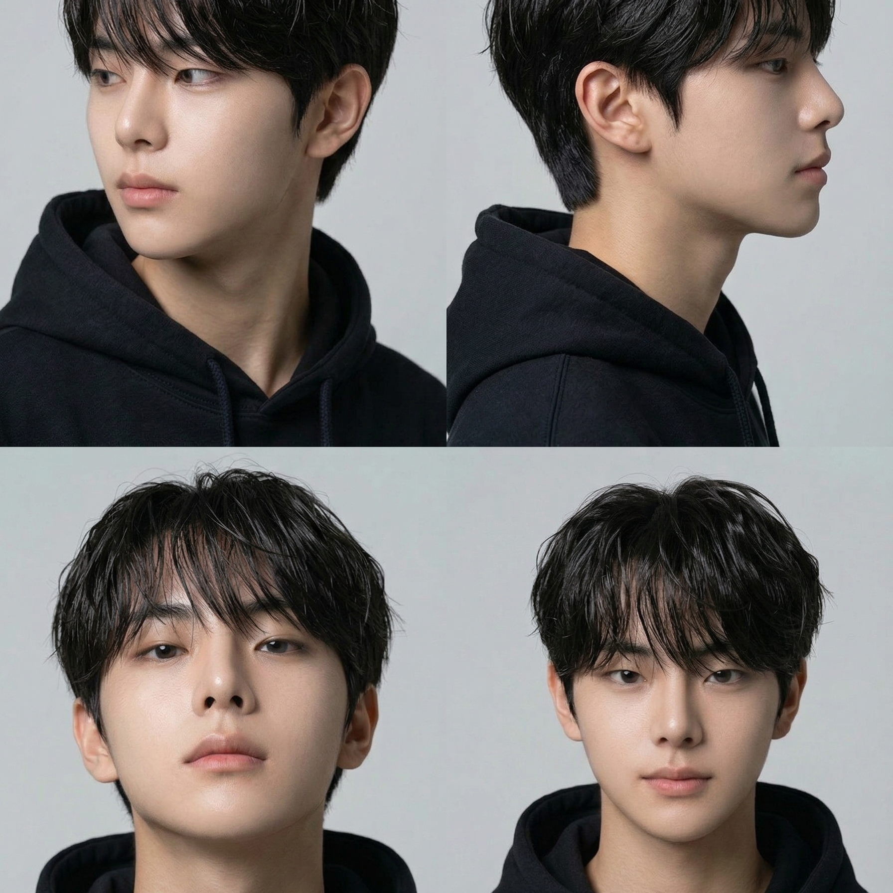
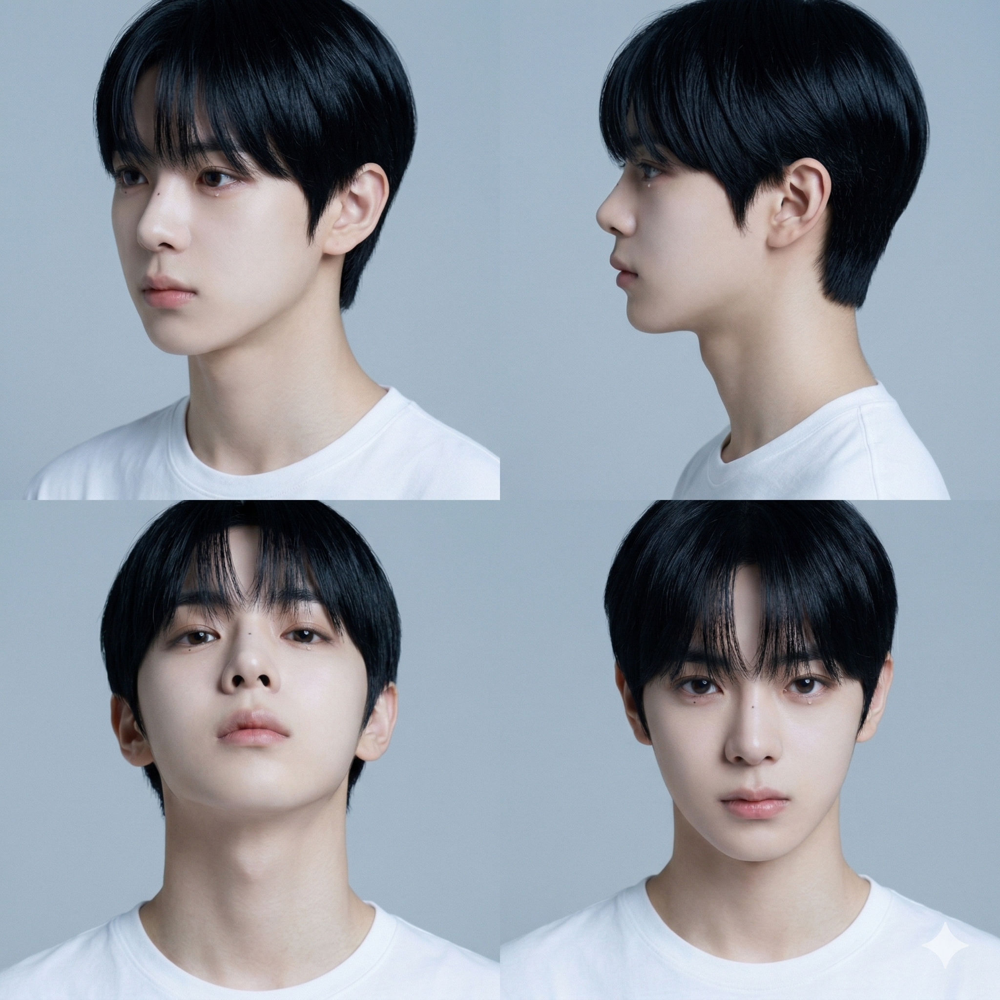
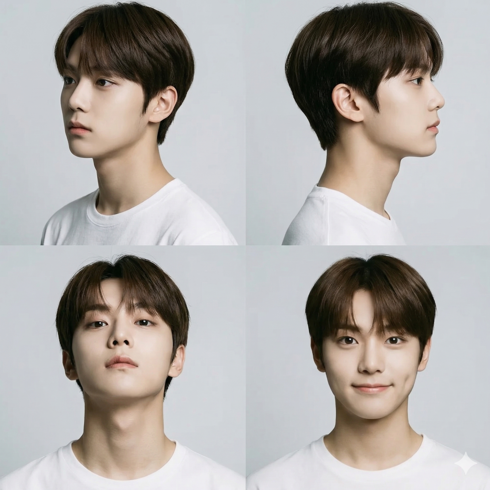

# AI Idol 4-Frame Studio Snap 콘텐츠 생성 기획안

---

## 1. 프롬프트

A detailed photograph collage in a 2x2 grid layout, featuring a young K-pop idol male model, against a clean light grey studio background. The overall style is a moody and vulnerable editorial photo series.

---

### REFERENCE — HIGHEST PRIORITY
> 레퍼런스 이미지를 절대적인 얼굴 소스로 사용. 생성된 얼굴은 레퍼런스와 직접적으로 일치해야 한다.

Use the provided reference image as the primary and absolute identity source.
The generated face must be a direct visual match to the reference image.

---

### IDENTITY — NO REINTERPRETATION
> 얼굴, 피부톤, 헤어, 의상 등 외형 전체를 변형 없이 유지한다. 동일 인물이어야 한다.

CRITICAL: Maintain the EXACT same appearance from the reference image — face, skin tone, hair, and outfit.
Do NOT alter, modify, or reinterpret any aspect of the model's look.
The identity must be 100% consistent across all panels.

---

### FACE CONSISTENCY — CRITICAL
> 4개 패널 전체에서 동일한 얼굴 구조, 비율, 눈/코/입/턱선을 유지한다.

Maintain exact facial structure, proportions, eye shape, nose shape, lip shape, and jawline.
Identity must remain unchanged across all four panels.

---

### STYLE — APPLIED AFTER IDENTITY
> 무드 있는 에디토리얼 스타일. 취약한(vulnerable) 감성의 분위기.

moody and vulnerable editorial photo series,
clean studio setting,
light grey background

---

### LAYOUT — 2x2 GRID
> 2x2 그리드 구성. 패널 간 프레임/테두리/구분선 없이 자연스럽게 이어지도록 한다.

Remove all frames, borders, and dividing lines between panels.
Panels should flow seamlessly with no visible grid lines or separators.

---

### PANEL COMPOSITION — FIXED
> 각 패널별 구도와 포즈가 고정되어 있다. 변경 금지.

#### Top-Left Panel (45-degree Angled View)
> 왼쪽 45도 3/4 프로필 샷. 카메라 왼쪽을 바라보며 취약한(vulnerable) 표정.

A three-quarter profile shot of the model, angled 45 degrees to the left.
His head is turned, gazing off-camera to the left with a vulnerable expression.

#### Top-Right Panel (Full Side Profile)
> 오른쪽 완전 측면 프로필. 정적인 자세.

A complete, direct side profile view of the model's right side.
His posture is still.

#### Bottom-Left Panel (Front-Facing, Slight Low Angle)
> 정면 약간 로우앵글. 카메라를 직시하며 무표정.

Front-facing shot with a slight low angle.
Direct eye contact with the camera, neutral expression.

#### Bottom-Right Panel (Front-Facing, Eye-Level)
> 정면 눈높이 앵글. 부드러운 시선.

Front-facing shot at eye level.
Soft, calm gaze toward the camera.

---

### OUTFIT
> 검정 후디. 전체 패널 동일.

Black hoodie, consistent across all four panels.

---

### LIGHTING
> 스튜디오 조명. 균일한 밝은 회색 배경.

Clean studio lighting,
even and soft,
light grey background

---

### DETAILS
> 자연스러운 피부 질감, 헤어 디테일. 고해상도 에디토리얼 퀄리티.

natural skin texture,
detailed hair strands,
high-resolution editorial quality,
no heavy retouching

---

### MOOD
> 감성적이고 취약한(vulnerable) 분위기. 조용한 내면을 드러내는 순간.

moody, vulnerable, introspective,
quiet emotional moment

---

## 2. 프롬프트 결과 이미지

| result_1 | result_2 |
|---|---|
|  |  |
| 검정 후디, 라이트 그레이 배경 | 화이트 티, 라이트 블루그레이 배경 |

| result_3 |
|---|
|  |
| 화이트 티, 라이트 그레이 배경, 미소 표정 포함 |
