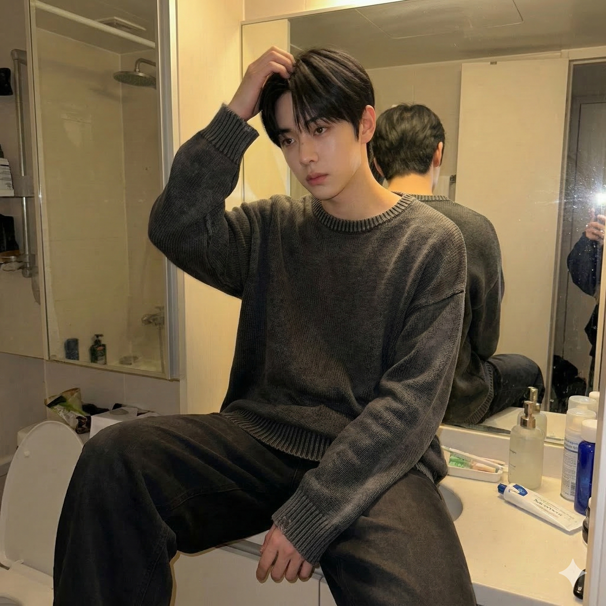
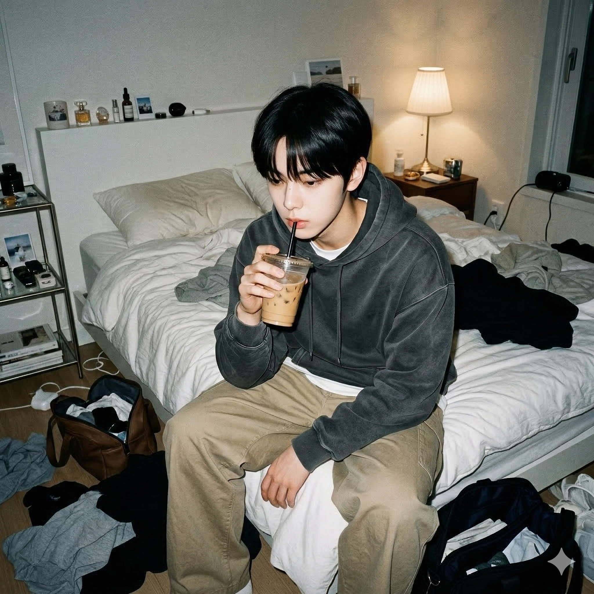
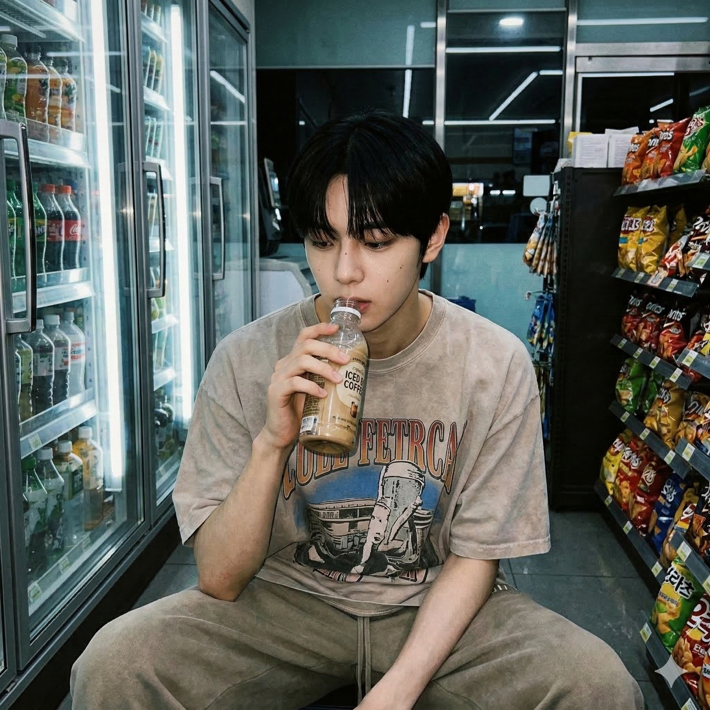
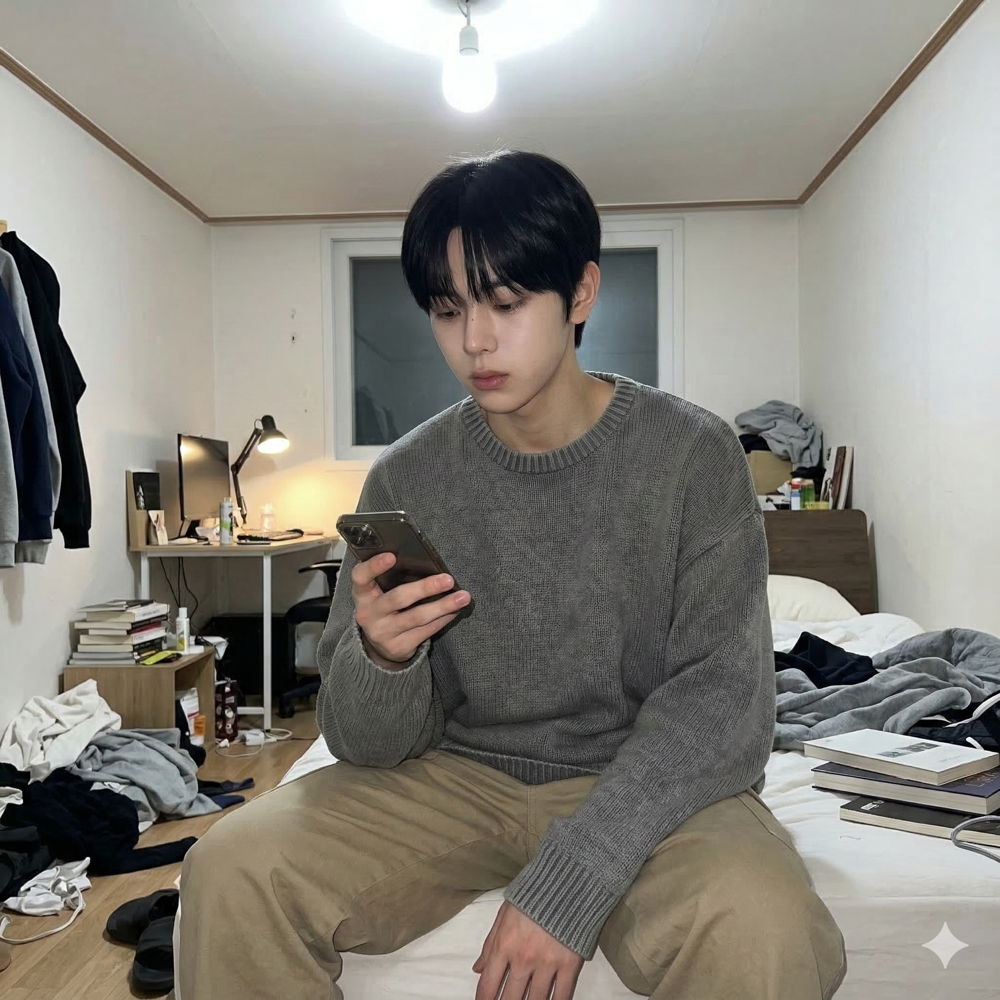
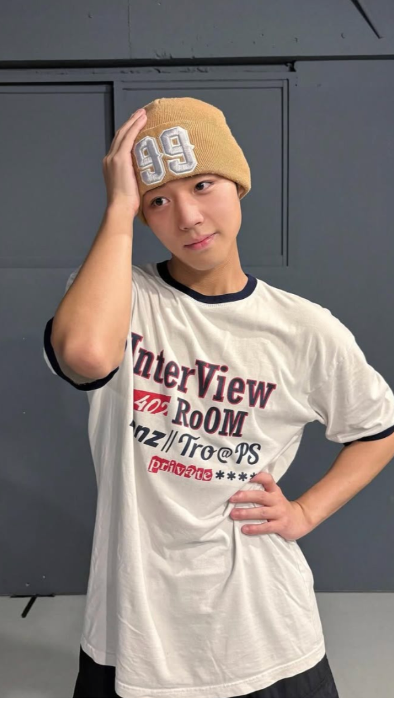
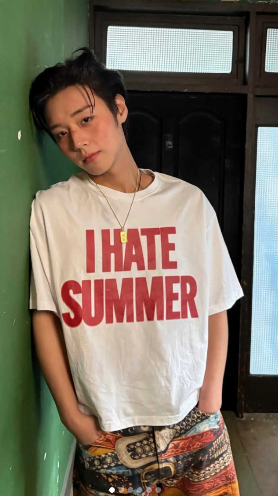
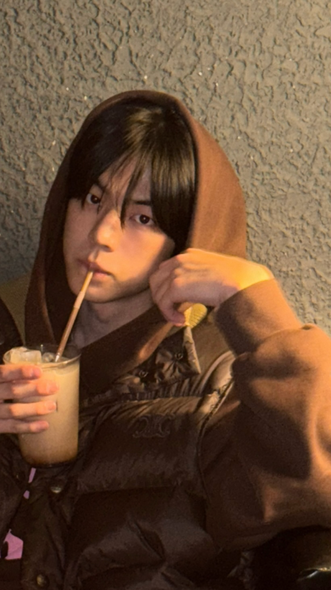
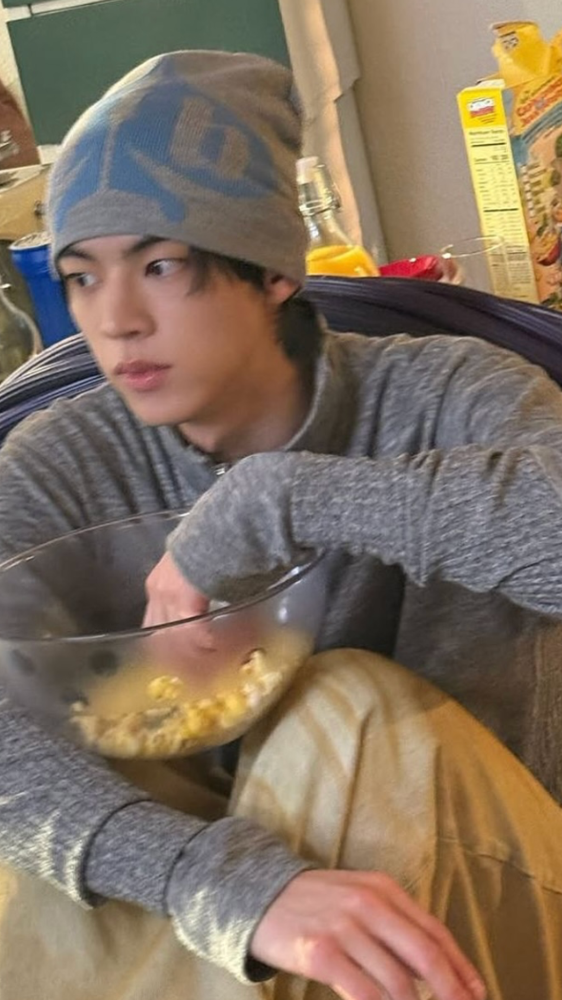
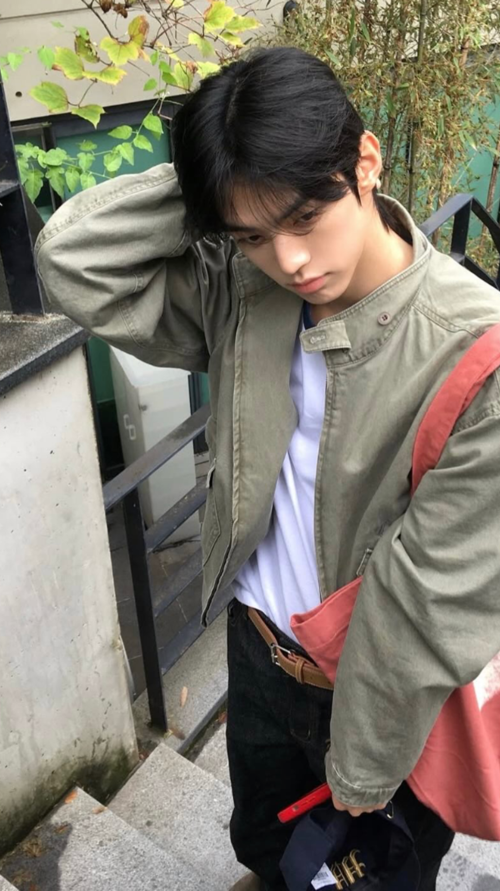
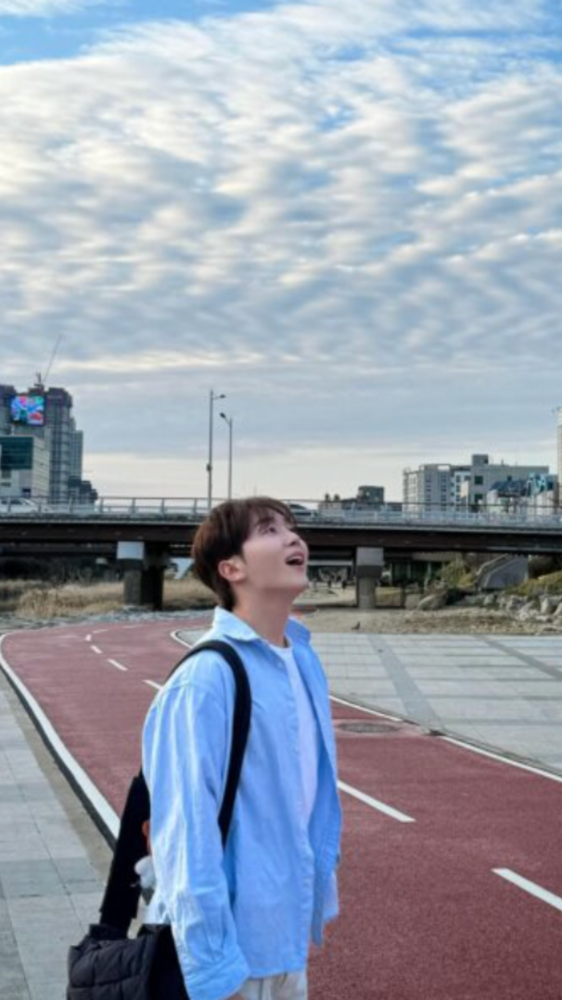

# AI Idol Daily Snap 콘텐츠 생성 기획안

---

## 1. 프롬프트

Generate a photorealistic image of a young East Asian male.

---

### REFERENCE — HIGHEST PRIORITY
> 레퍼런스 이미지를 절대적인 얼굴 소스로 사용. 생성된 얼굴은 레퍼런스와 직접적으로 일치해야 한다.

Use the provided reference image as the primary and absolute identity source.
The generated face must be a direct visual match to the reference image.

---

### IDENTITY — NO REINTERPRETATION
> 얼굴을 재디자인하거나 근사치로 생성하지 않는다. 비슷한 사람이 아닌 동일 인물이어야 한다.

Do not redesign, reinterpret, or approximate the face.
Do not generate a similar-looking person.
The output must preserve the exact same identity as the reference.

---

### FACE CONSISTENCY — CRITICAL
> 얼굴 구조, 비율, 눈/코/입/턱선 등 세부 요소를 정확히 유지한다.

Maintain exact facial structure, proportions, eye shape, nose shape, lip shape, and jawline.
Identity must remain unchanged under any condition.

---

### STYLE — APPLIED AFTER IDENTITY
> 얼굴 고정 후 적용되는 스타일. 친구가 아이폰으로 불쑥 찍은 듯한 무포즈 일상 사진 느낌.

raw casual daily moment,
unposed and effortless,
slightly awkward composition,
like a random iPhone photo taken by a friend

---

### SCENE — CONTROLLED RANDOM SELECTION
> 장소를 먼저 선택하고, 해당 장소에 자연스러운 행동을 매칭한다. 부자연스러운 조합 금지.

Select ONE location first.
Then select an action that naturally fits that location.
Do NOT create unnatural combinations.

#### Location (choose one)
> 촬영 장소. 1개만 선택.

1. dim convenience store at night
2. underground parking lot
3. messy bedroom
4. narrow bathroom mirror
5. staircase in old apartment

#### Action (must match the location naturally)
> 장소별 고정 매칭 행동. 장소 선택 시 자동 결정.

1. convenience store → holding iced coffee, about to drink
2. parking lot → leaning loosely against wall
3. bedroom → sitting slouched, scrolling phone
4. bathroom → fixing hair slowly
5. staircase → sitting with knees pulled in

---

### Gaze (choose one)
> 시선 방향. 1개만 선택.

1. looking down
2. looking to the side
3. unfocused blank stare
4. ignoring the camera

---

### EXPRESSION — SUBTLE VARIATION
> 낮은 강도의 자연스러운 표정. 1개만 선택.

Choose ONE natural, low-intensity expression:

1. neutral face, relaxed
2. slightly tired eyes
3. lips slightly parted
4. faint hint of a smile (almost unnoticeable)
5. blank, emotionless expression
6. mildly distracted expression

---

### CAMERA — RANDOM VIEWPOINT
> 카메라 앵글/구도. 1개만 선택.

Choose ONE camera perspective:

1. eye-level, slightly off-center framing
2. slightly low angle
3. slightly high angle
4. close-up with partial face cropping
5. medium shot with empty space
6. side angle

---

### Outfit (choose one)
> 의상. 1개만 선택.

1. faded oversized graphic t-shirt + loose sweatpants
2. washed black oversized t-shirt + wide denim
3. hoodie + white t-shirt + loose pants
4. oversized knit + relaxed pants

---

### LIGHTING
> 스마트폰 카메라로 찍은 듯한 불균일한 조명. 자연광 또는 거친 실내광.

smartphone camera look,
slightly uneven lighting,
natural or harsh indoor light

---

### DETAILS
> 사실감을 높이는 디테일 요소. 피부 질감, 모션 블러, 노이즈, 불완전한 프레이밍.

natural skin texture,
slight motion blur,
grain or noise,
background clutter,
imperfect framing

---

### PROPORTION CONTROL — CRITICAL
> 자연스러운 신체 비율 유지. 머리 과대/어깨 과소 금지. 상반신(가슴, 어깨)이 보이는 프레이밍 우선.

Maintain natural body proportions.
Shoulders must appear naturally broad and balanced relative to the head.
Avoid narrow shoulders.
Avoid oversized head proportions.
Do not crop too tightly around the face.
Prefer framing that includes upper body (chest and shoulders visible).

---

### MOOD
> 무심한 분위기. 우연히 포착된 순간.

indifferent,
like a random captured moment

---

### VARIATION CONTROL
> 생성할 때마다 다른 조합을 우선하여 결과물 간 다양성을 확보한다.

Avoid repeating the same composition, pose, or scenario.
Prioritize different combinations across generations.
Each output should feel like a different real-life moment.

---

## 2. 프롬프트 결과 이미지

| result_1 | result_2 |
|---|---|
|  |  |
| 화장실 거울, 니트, 머리 만지기 | 침실, 후디+흰티+루즈팬츠, 아이스커피 |

| result_3 | result_4 |
|---|---|
|  |  |
| 편의점, 그래픽티+스웨트팬츠, 음료 마시기 | 침실, 니트+루즈팬츠, 폰 스크롤 |

---

## 3. 레퍼런스 이미지 (스타일 참고)

| 일상-1 | 일상-2 | 일상-3 |
|---|---|---|
|  |  |  |
| 비니+그래픽티, 포즈, 실내 | 벽 기대기, 레터링티, 무심한 표정 | 후디+패딩, 음료 마시기, 야간 |

| 일상-4 | 일상-5 | 일상-6 |
|---|---|---|
|  |  |  |
| 비니+회색 맨투맨, 먹기, 부엌 | 카키 자켓, 계단, 시선 아래 | 하늘색 셔츠, 한강, 하늘 올려보기 |
