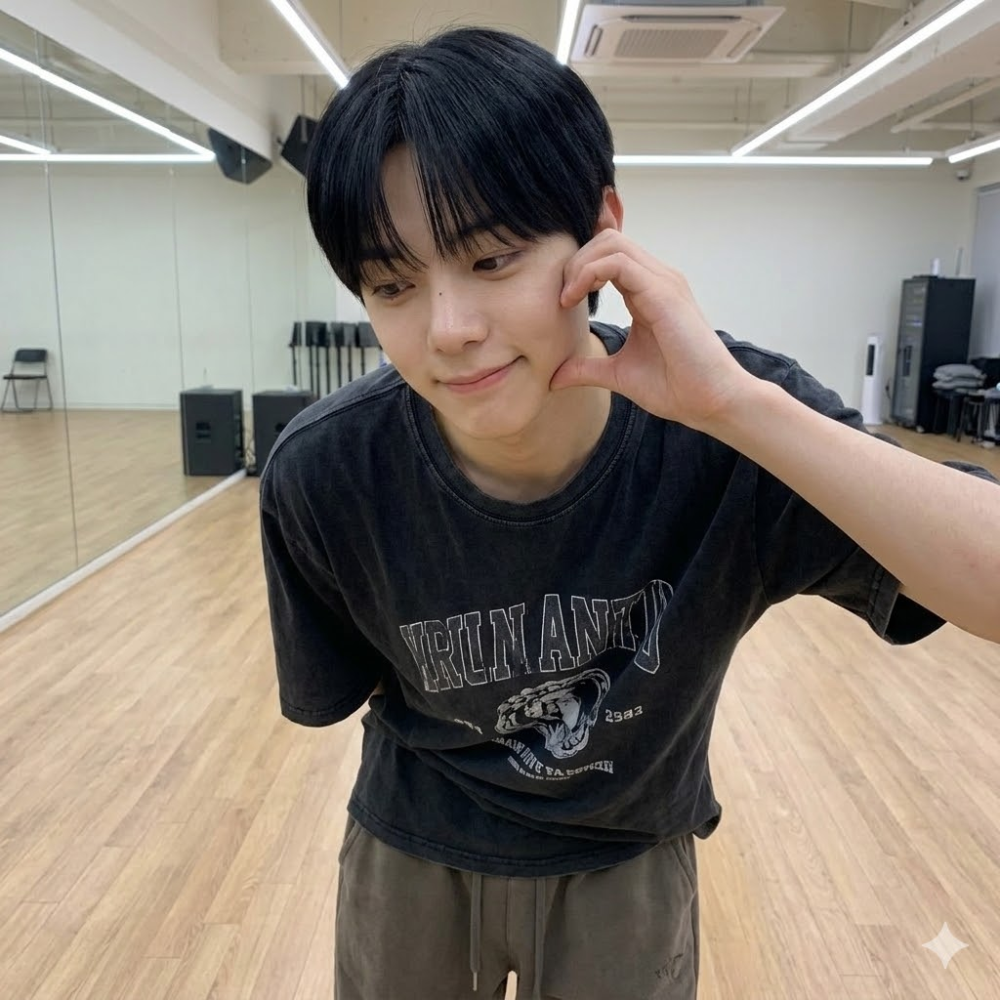
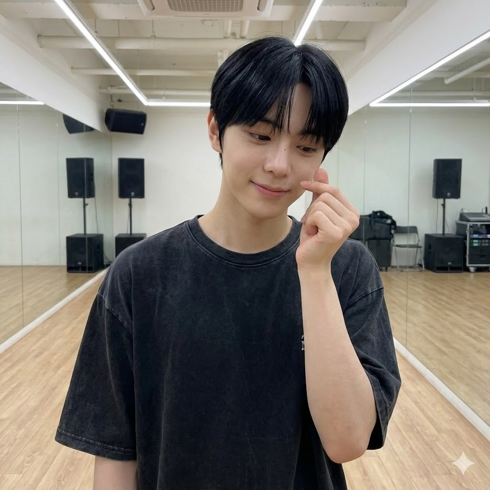
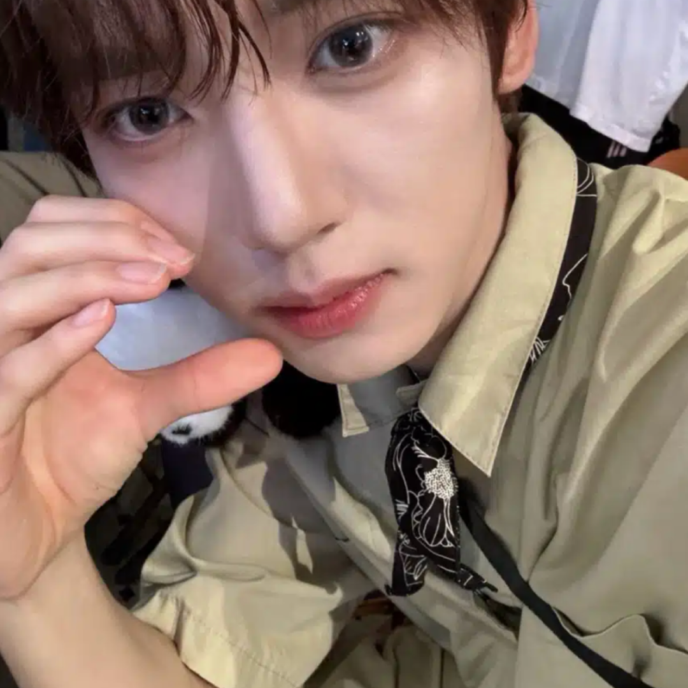

# AI Idol Finger Heart 콘텐츠 생성 기획안

---

## 1. 프롬프트

Generate a photorealistic image of a young East Asian male.

---

### REFERENCE — HIGHEST PRIORITY
> 레퍼런스 이미지를 절대적인 얼굴 소스로 사용. 생성된 얼굴은 레퍼런스와 직접적으로 일치해야 한다.

Use the provided reference image as the primary and absolute identity source.
The generated face must be a direct visual match to the reference image.

---

### IDENTITY — NO REINTERPRETATION
> 얼굴을 재디자인하거나 근사치로 생성하지 않는다. 비슷한 사람이 아닌 동일 인물이어야 한다.

Do not redesign, reinterpret, or approximate the face.
Do not generate a similar-looking person.
The output must preserve the exact same identity as the reference.

---

### FACE CONSISTENCY — CRITICAL
> 얼굴 구조, 비율, 눈/코/입/턱선 등 세부 요소를 정확히 유지한다.

Maintain exact facial structure, proportions, eye shape, nose shape, lip shape, and jawline.
Identity must remain unchanged under any condition.

---

### IDENTITY ENFORCEMENT — STRONG LOCK
> 모든 조명/앵글에서 얼굴 동일성 유지. 미화, 스타일화, 이상화 금지. 미적 목적의 비율 변경 금지.

Face must remain identical to the reference under all lighting and angles.
Do not beautify, stylize, or idealize the face.
Do not modify proportions for aesthetic purposes.

---

### STYLE — NATURAL YOUTH REALISM
> 자연스러운 한국 Z세대 일상 룩. 과한 스타일링 없이 아이폰으로 찍은 캐주얼한 순간.

natural Korean Gen Z daily look,
soft youthful features,
clean but realistic appearance,
effortlessly stylish,
no heavy styling,
like a real casual moment captured on iPhone,
light, soft, and natural mood

---

### SCENE
> 케이팝 연습실. 거울 벽, 나무 바닥, 스피커/장비가 보이는 자연스러운 연습 환경.

K-pop practice room,
large mirror wall,
wooden floor,
speakers or studio equipment in background,
natural and slightly messy training environment

---

### ACTION
> 볼 옆에서 작은 손하트. 캐주얼하고 살짝 수줍은 느낌. 쉬는 시간에 빠르게 찍는 사진처럼.

making a small finger heart near the cheek,
gesture should be casual and slightly shy, not exaggerated,
as if taking a quick photo during a break

---

### Gaze (choose one)
> 시선 방향. 1개만 선택.

1. looking slightly down with a soft smile
2. glancing to the side playfully
3. shy eye contact with camera
4. avoiding camera with a small smile

---

### Expression (choose one)
> 표정. 1개만 선택.

1. soft smile
2. slightly embarrassed smile
3. shy smile
4. relaxed face with bright eyes

---

### Camera (choose one)
> 카메라 앵글/구도. 1개만 선택.

1. close-up (face dominant, slight crop)
2. close-up from slight angle
3. chest-up medium shot
4. slight high angle close shot

---

### Outfit (choose one)
> 의상. 1개만 선택.

1. oversized graphic t-shirt + loose sweatpants
2. washed black oversized t-shirt + wide denim
3. hoodie + white t-shirt + loose pants
4. oversized knit + relaxed pants

---

### LIGHTING
> 실내 형광등 또는 소프트 스튜디오 조명. 거울 반사에 의한 부드러운 그림자.

indoor fluorescent or soft studio lighting,
slightly uneven exposure,
clean smartphone camera look,
soft shadows with mild reflection from mirror

---

### FACE RENDERING — BALANCED REALISM
> 깨끗하고 자연스러운 피부. 과도한 모공/잡티 없이, 플라스틱 느낌도 없는 균형 잡힌 리얼리즘.

clean and natural skin texture,
smooth but realistic skin,
subtle skin detail,
even skin tone with slight natural variation,
no heavy blemishes,
no exaggerated pores,
no plastic or artificial skin

---

### FACE PRIORITY
> 얼굴이 메인 포컬 포인트. 깨끗하고 자연스러운 피부를 우선하면서 Identity 유지.

The face must remain the main focal point.
Facial details must be sharp, clear, and recognizable.
prioritize clean, natural-looking skin while preserving identity

---

### FRAMING
> 클로즈업 또는 가슴 위 프레이밍. 얼굴과 손하트 제스처가 모두 보여야 한다.

Use close-up or chest-up framing.
Ensure the face and hand gesture are clearly visible.

---

### PROPORTION
> 자연스러운 신체 비율 유지. 머리 과대/어깨 과소 금지.

Maintain natural body proportions.
Shoulders must appear balanced and not narrow.
Avoid oversized head ratio.

---

### DETAILS
> 깨끗한 피부에 자연스러운 부드러움. 거친 노이즈 없이 스마트폰 카메라 특유의 약간의 소프트니스.

clean skin with natural softness,
light natural texture,
no harsh grain,
no excessive noise,
realistic lighting on skin,
slight softness from smartphone camera

---

### MOOD
> 가볍고 수줍은 장난스러움. 연습 쉬는 시간의 남자친구 느낌.

light, shy, playful,
soft boyfriend-style moment,
like a short break during practice

---

### ANTI-AI LOOK
> AI 생성 느낌 방지. 과도하게 선명하거나 플라스틱 같은 피부 금지. 자연스러운 인간 피부 유지.

avoid overly sharp or harsh skin detail,
avoid plastic or overly blurred skin,
maintain natural, clean, human skin appearance

---

## 2. 프롬프트 결과 이미지

| result_1 | result_2 | result_3 |
|---|---|---|
|  |  |  |
| 연습실, 그래픽티+스웨트팬츠, 손하트, 수줍은 미소 | 연습실, 워싱 블랙티+데님, 손하트, 바닥 앉기 | 연습실, 워싱 블랙티, 손하트, 서서 포즈 |

---

## 3. 레퍼런스 이미지 (스타일 참고)

| 볼하트-1 | 볼하트-5 | 볼하트-6 |
|---|---|---|
|  |  |  |
| 흰 셔츠, 손하트, 클로즈업 | 블랙 자켓+흰티, 손하트, 셀카 | 카키 셔츠, 볼 터치, 클로즈업 |
