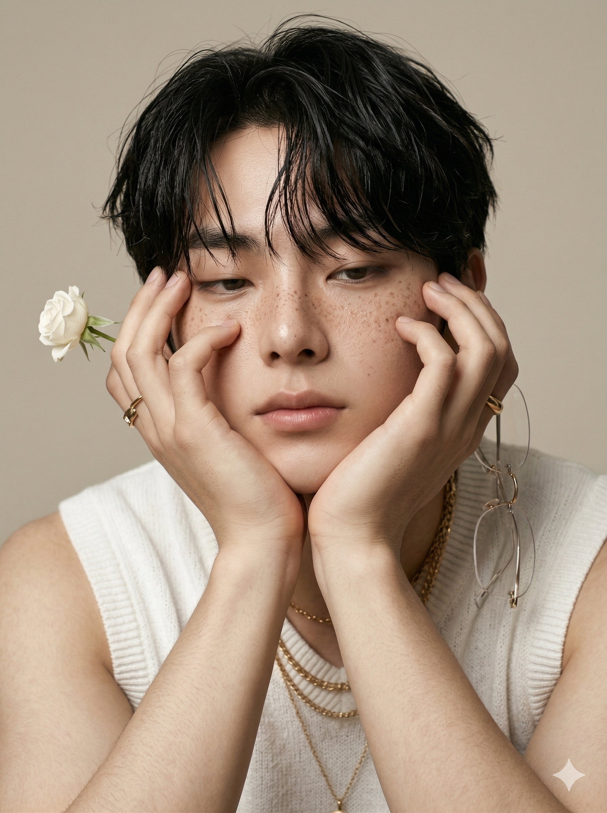
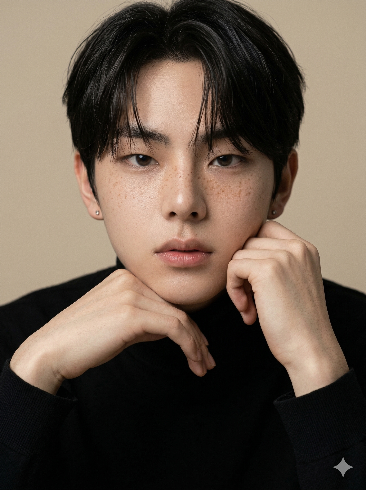
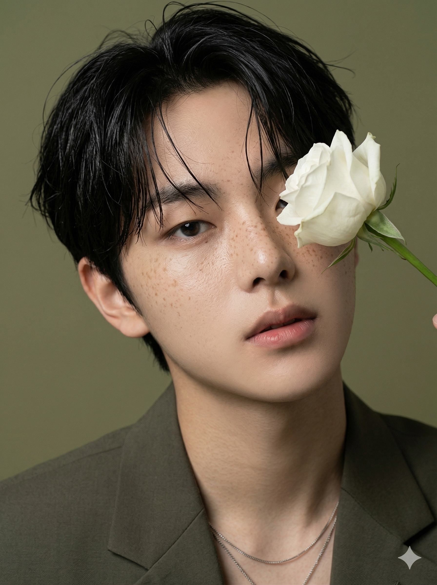
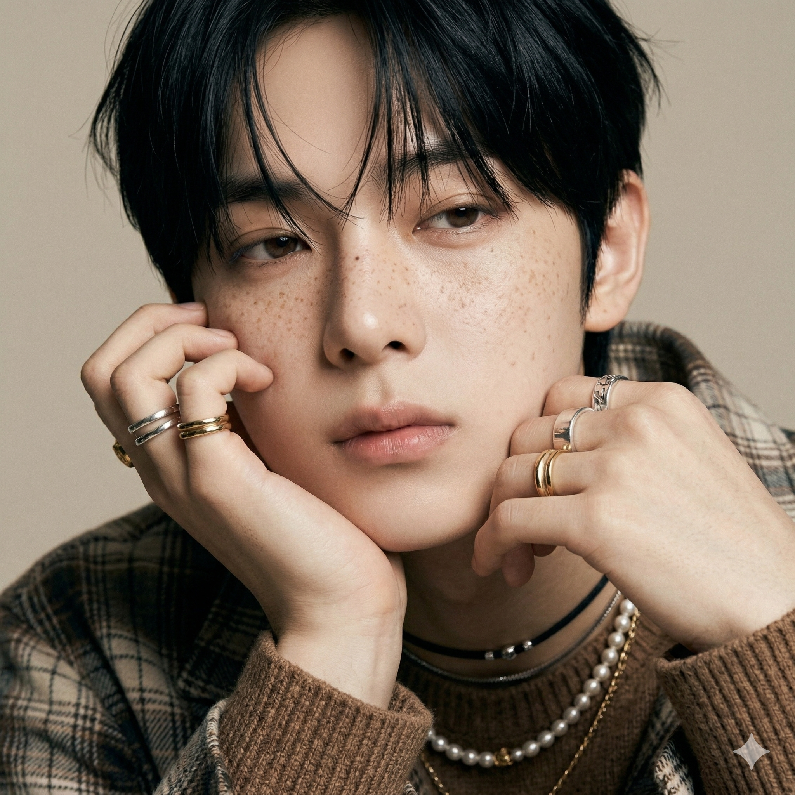
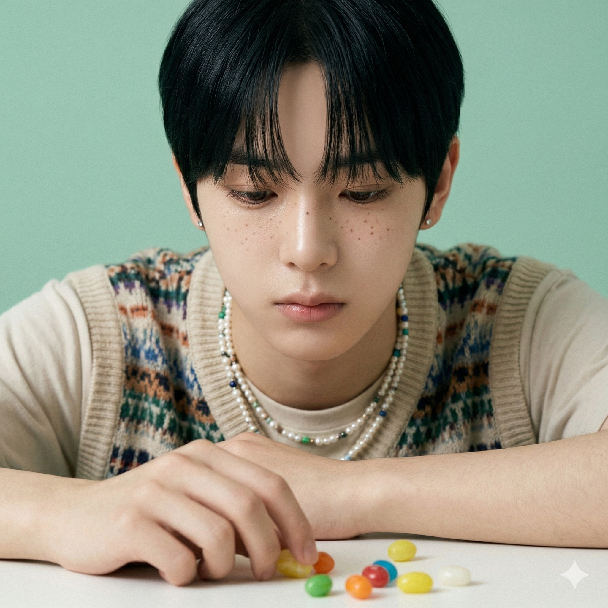
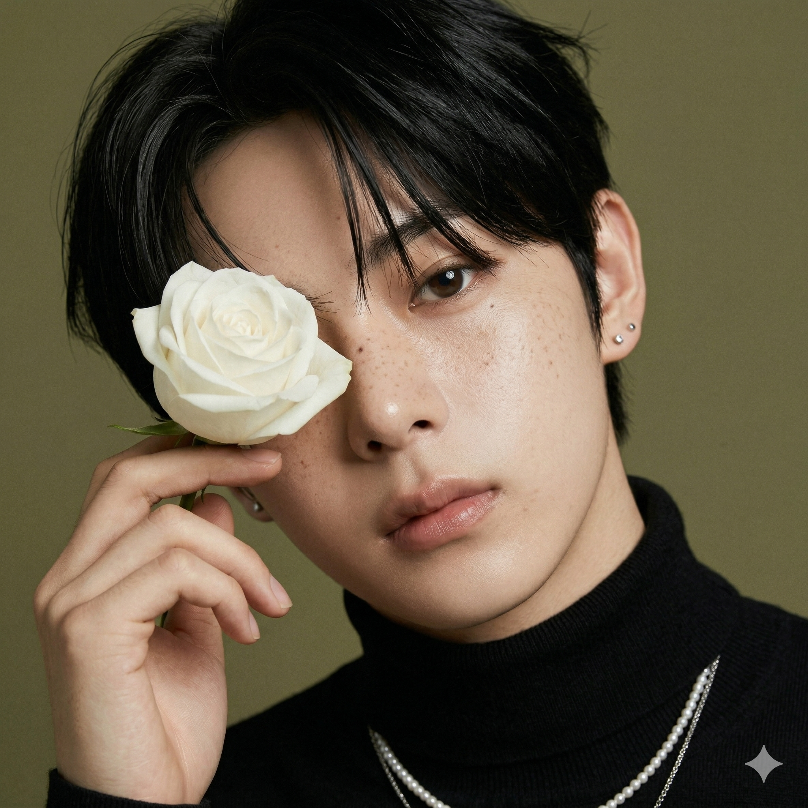
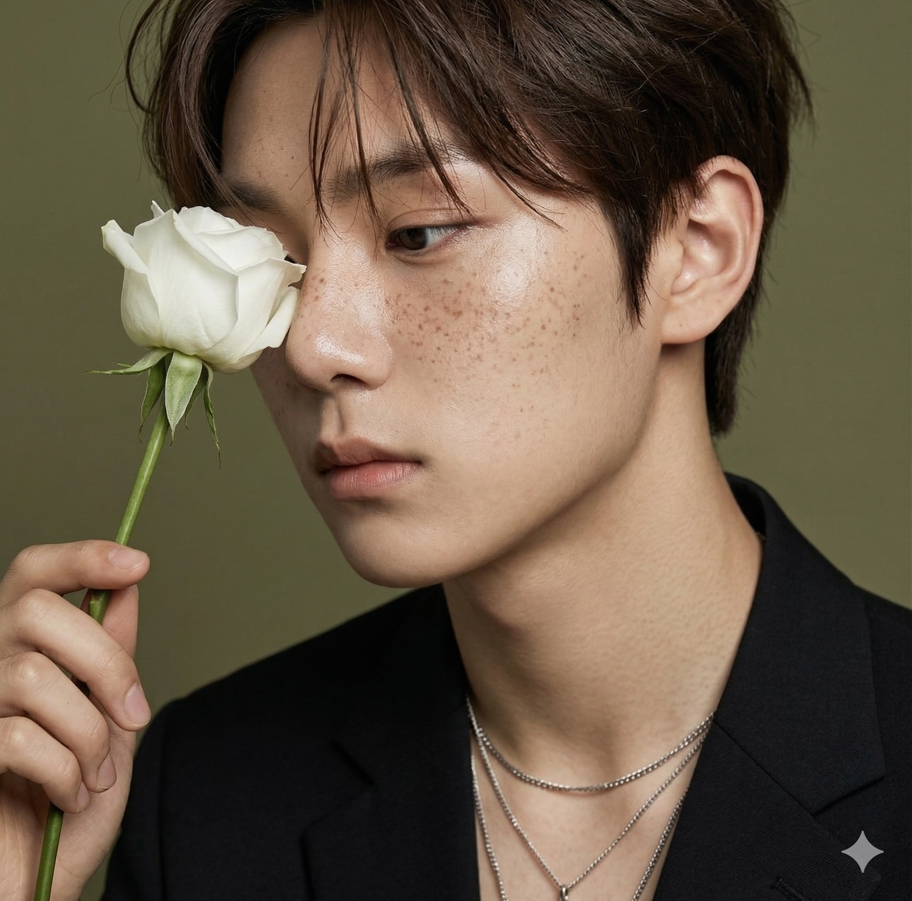
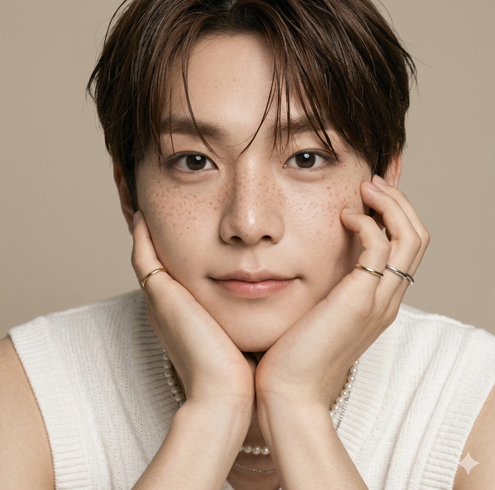

# AI Idol Freckle Kitsch Portrait 콘텐츠 생성 기획안

> 본 문서는 컨셉 탐색용 기획안입니다. 검증 완료 후 `content-prompt-guide` 모듈식 구조(Python + JSON 조합)로 전환 예정.

---

## 1. 프롬프트

Generate a photorealistic image of a young East Asian male.

---

### REFERENCE -- HIGHEST PRIORITY
> 레퍼런스 이미지를 절대적인 얼굴 소스로 사용. 생성된 얼굴은 레퍼런스와 직접적으로 일치해야 한다.

Use the provided reference image as the primary and absolute identity source.
The generated face must be a direct visual match to the reference image.

---

### IDENTITY -- NO REINTERPRETATION
> 얼굴을 재디자인하거나 근사치로 생성하지 않는다. 비슷한 사람이 아닌 동일 인물이어야 한다.

Do not redesign, reinterpret, or approximate the face.
Do not generate a similar-looking person.
The output must preserve the exact same identity as the reference.

---

### FACE CONSISTENCY -- CRITICAL
> 얼굴 구조, 비율, 눈/코/입/턱선 등 세부 요소를 정확히 유지한다.

Maintain exact facial structure, proportions, eye shape, nose shape, lip shape, and jawline.
Identity must remain unchanged under any condition.

---

### STYLE -- Refined Editorial Kitsch
> 매거진 에디토리얼 퀄리티의 세련된 포트레이트. 키치 요소는 소품과 컬러로 절제되게 표현. 뮤트톤 컬러 팔레트.

refined editorial portrait with subtle kitsch undertone,
magazine-quality fashion photography,
muted earthy color palette,
sophisticated and quietly playful,
minimal yet intentional styling

---

### SCENE
> 뮤트톤 스튜디오 배경에서 촬영하는 얼굴 클로즈업 에디토리얼 시리즈.

Select ONE location and match the action naturally.

#### Location (choose one)
> 촬영 장소. 1개만 선택.

1. solid muted olive-green studio backdrop
2. soft neutral beige studio backdrop
3. muted mint-green studio backdrop with white table
4. dark teal studio backdrop

#### Action (must match naturally)
> 장소별 고정 매칭 행동. 장소 선택 시 자동 결정.

1. muted olive backdrop -> holding a single white rose near face, partially covering one eye
2. neutral beige backdrop -> both hands resting on chin and cheek, leaning forward
3. mint-green backdrop with table -> arms on white table, playing with small colorful objects or candy
4. dark teal backdrop -> one hand pulling hair up, the other resting near collarbone

---

### Gaze (choose one)
> 시선 방향. 1개만 선택.

1. looking directly into the camera with quiet intensity
2. soft half-lidded gaze, slightly downward
3. looking down at hands or object, contemplative
4. gentle side glance with relaxed eyes

---

### Expression (choose one)
> 표정. 1개만 선택.

1. neutral with slightly parted lips, effortlessly cool
2. subtle closed-mouth smile, calm confidence
3. soft pout, understated and natural
4. dreamy unfocused expression, lost in thought

---

### Camera (choose one)
> 카메라 앵글/구도. 1개만 선택.

1. extreme close-up, face filling the frame, freckles in sharp detail
2. slightly tilted close-up portrait, one eye partially obscured by prop or hand
3. close-up from slightly above, looking up at camera
4. tight headshot with shallow depth of field, soft background blur
5. three-quarter view from diagonal angle, nose bridge and cheekbone freckles highlighted
6. profile side view close-up, jawline and ear visible, freckles on cheek in focus
7. over-the-shoulder angle looking back at camera, partial face visible with freckles catching light

---

### Outfit (choose one)
> 의상. 1개만 선택.

1. black blazer or jacket, minimal, collar visible with layered silver necklaces
2. white knit sleeveless top with layered gold chain necklaces and rings
3. patterned knit vest over plain tee, pearl and bead necklace layered
4. brown knit sweater under plaid overshirt, layered choker and pearl necklaces
5. sheer mesh long-sleeve top, skin slightly visible, silver rings on fingers
6. oversized denim jacket worn off one shoulder, thin chain necklace
7. striped open-collar shirt, loosely buttoned, collarbone exposed with pendant necklace
8. plain black turtleneck, minimal, focus on face and small stud earrings

---

### LIGHTING
> 소프트 디퓨즈드 스튜디오 조명. 피부 위에 자연스러운 음영이 떨어지는 부드럽고 고급스러운 라이팅.

soft diffused studio lighting,
gentle directional light from one side,
natural shadow on opposite side of face,
subtle warm-to-neutral color temperature,
no harsh highlights,
editorial magazine-quality lighting

---

### FACE RENDERING -- Critical Realism
> 주근깨가 핵심 요소. 피부 질감, 모공, 주근깨 입자가 선명하게 드러나야 한다. 뷰티 필터 효과 금지.

prominent natural freckles scattered across nose bridge and cheeks,
realistic skin texture with visible pores,
slight natural unevenness in skin tone,
no plastic skin,
no over-smoothing,
no beauty filter effect,
natural lighting on face,
preserve real human imperfections

---

### FACE PRIORITY
> 얼굴이 메인 포컬 포인트. 얼굴 디테일은 선명하고 인식 가능해야 한다.

The face must remain the main focal point.
Facial details must be sharp, clear, and recognizable.

---

### FRAMING
> 얼굴 위주의 타이트한 프레이밍. 배경은 최소한으로, 얼굴이 프레임의 대부분을 차지.

tight face-centric framing,
face occupies most of the frame,
minimal background visible,
shallow depth of field with background softly blurred

---

### PROPORTION
> 자연스러운 신체 비율 유지. 머리 과대/어깨 과소 금지.

Maintain natural body proportions.
Shoulders must appear balanced and not narrow.
Avoid oversized head ratio.

---

### DETAILS
> 주근깨 디테일이 가장 중요. 웻헤어 질감, 레이어드 주얼리, 절제된 소품. 매거진 에디토리얼 수준의 디테일.

natural freckles clearly visible across nose bridge and both cheeks,
freckle density medium to high,
individual freckle dots distinguishable,
slightly wet or tousled hair with loose strands falling on face,
layered jewelry details (pearl necklace, thin chain, rings),
subtle editorial props (white rose, small candy, rimless glasses),
slight lip tint for natural color accent,
natural dewy skin finish

---

### MOOD
> 절제된 세련미 속 조용한 장난기. 고급스럽지만 따뜻한 감성.

quietly playful yet refined,
editorial sophistication with warmth,
calm confidence,
intimate and personal,
understated kitsch charm

---

### ANTI-AI LOOK
> AI 생성 느낌 방지. 과도하게 선명하거나 플라스틱 같은 피부 금지. 자연스러운 인간 피부 유지.

avoid overly sharp or harsh skin detail,
avoid plastic or overly blurred skin,
maintain natural, clean, human skin appearance

---

### VARIATION CONTROL
> 주근깨 패턴과 위치를 모든 이미지에서 일관되게 유지. 주근깨 밀도와 분포가 컷마다 달라지지 않도록 한다.

freckle pattern and placement must remain consistent across all generated images,
freckle density and distribution should not change between shots,
maintain same freckle map on nose bridge and cheeks in every variation

---

## 2. 프롬프트 결과 이미지

| # | 이미지 | 조합 | 설명 |
|---|---|---|---|
| 1 |  | Location 2 + Camera 1 + Outfit 2 + Expression 3 + Gaze 1 | 베이지 배경, 흰 니트 민소매, 양손 턱 괴기, 흰 장미 + 무태안경, 골드 레이어드 목걸이 |
| 2 |  | Location 2 + Camera 1 + Outfit 8 + Expression 1 + Gaze 1 | 베이지 배경, 블랙 터틀넥, 한손 턱 괴기, 스터드 귀걸이, 차분한 정면 응시 |
| 3 |  | Location 1 + Camera 5 + Outfit 1 + Expression 1 + Gaze 1 | 올리브 배경, 올리브 블레이저, 흰 장미로 한쪽 눈 가림, 실버 체인 목걸이, 3/4뷰 |
| 4 |  | Location 2 + Camera 1 + Outfit 4 + Expression 1 + Gaze 1 | 베이지 배경, 체크 셔츠 + 브라운 니트, 양손 턱 괴기, 골드/실버 링, 펄 목걸이 |
| 5 |  | Location 3 + Camera 3 + Outfit 3 + Expression 1 + Gaze 3 | 민트 배경, 패턴 니트 베스트, 테이블 위 젤리 만지기, 펄+비즈 레이어드 목걸이 |
| 6 |  | Location 1 + Camera 2 + Outfit 8 + Expression 1 + Gaze 1 | 올리브 배경, 블랙 터틀넥, 흰 장미로 한쪽 눈 가림, 실버 목걸이, 스터드 귀걸이 |
| 7 |  | Location 1 + Camera 6 + Outfit 1 + Expression 3 + Gaze 4 | 올리브 배경, 블랙 블레이저, 흰 장미 들고 3/4 측면뷰, 실버 레이어드 목걸이 |
| 8 |  | Location 2 + Camera 1 + Outfit 2 + Expression 2 + Gaze 1 | 베이지 배경, 흰 니트 민소매, 양손 턱 괴기, 미소, 골드 링 + 펄 목걸이 |

---

## 3. 레퍼런스 이미지 (스타일 참고)

> 레퍼런스 이미지가 있으면 이 섹션에 추가하세요.
