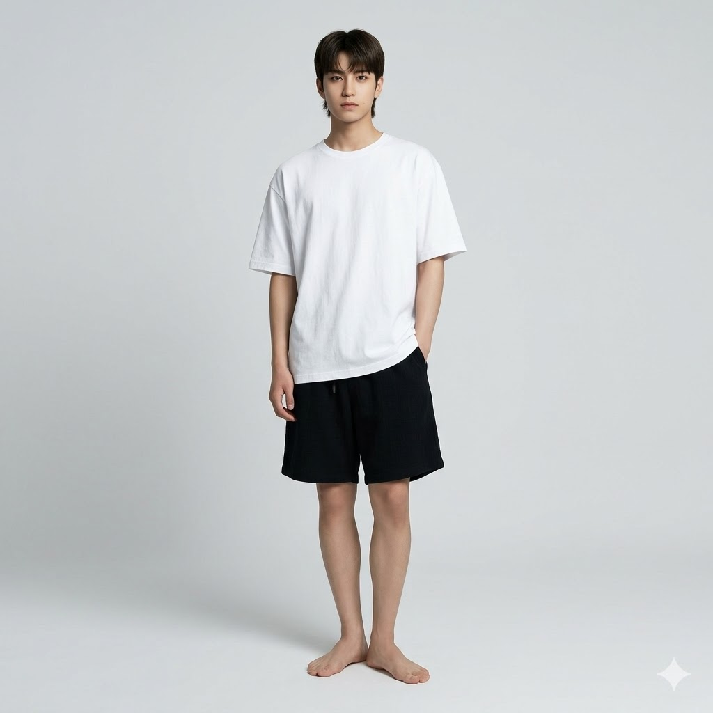
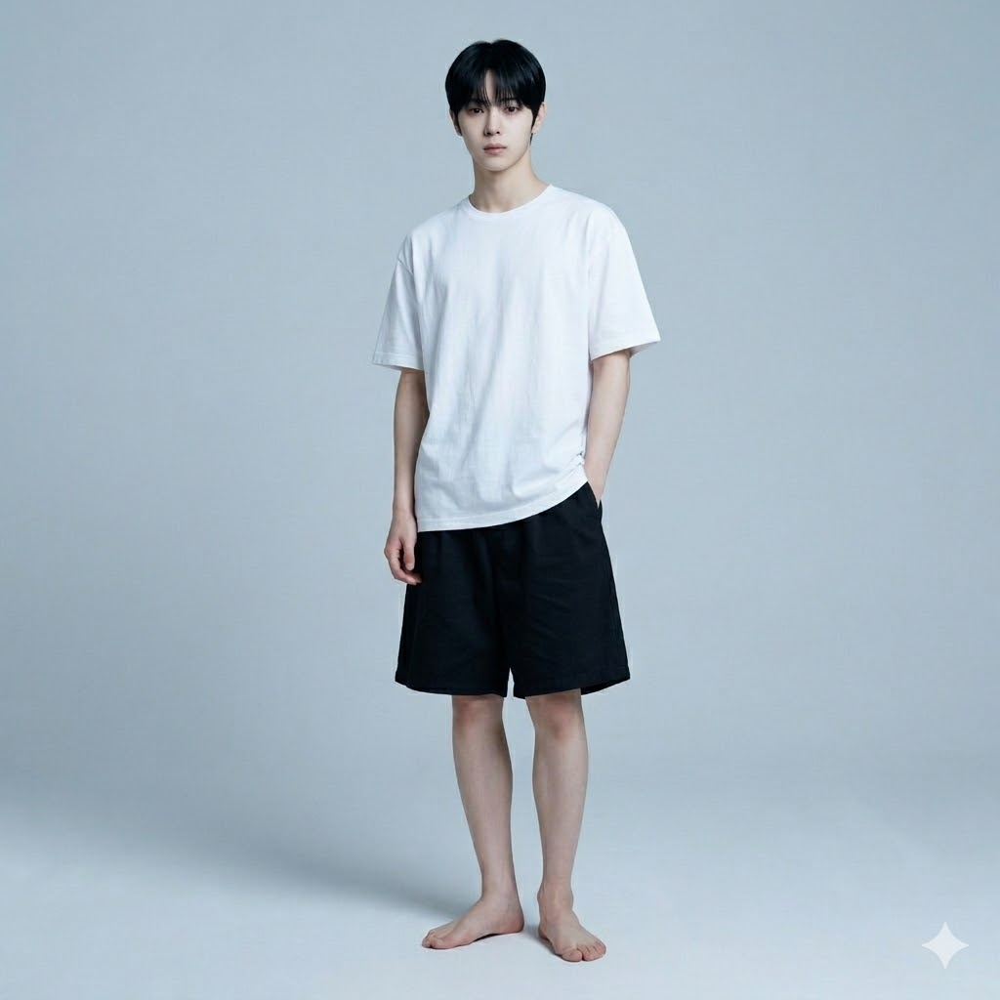
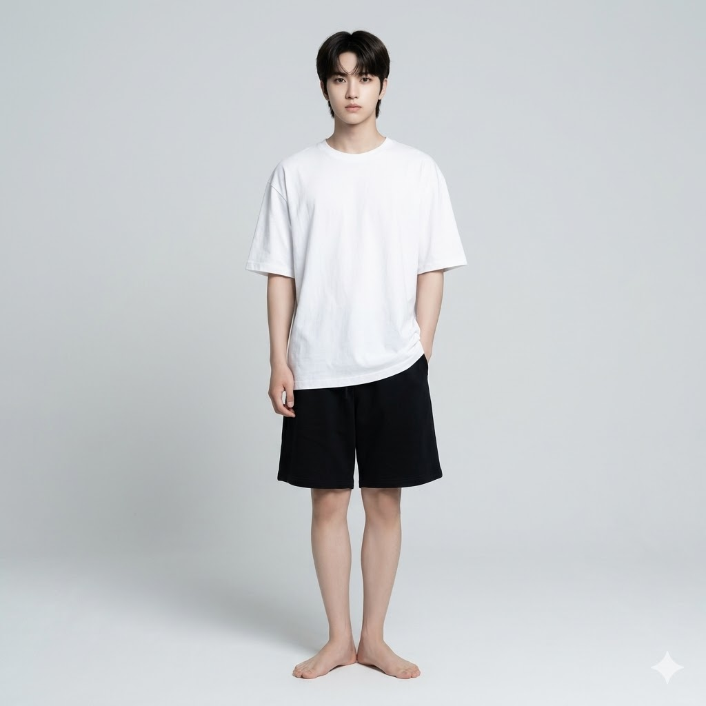

# AI Idol Full-Body Studio 콘텐츠 생성 기획안

---

## 1. 프롬프트

A full-body shot of a 19-year-old Korean male idol with refined, soft yet sharp facial features, pale smooth skin, and calm, slightly melancholic eyes.

---

### REFERENCE — HIGHEST PRIORITY
> 레퍼런스 이미지를 절대적인 얼굴 소스로 사용. 생성된 얼굴은 레퍼런스와 직접적으로 일치해야 한다.

Use the provided reference image as the primary and absolute identity source.
The generated face must be a direct visual match to the reference image.

---

### IDENTITY — NO REINTERPRETATION
> 얼굴, 피부톤, 헤어, 체형 등 외형 전체를 변형 없이 유지한다. 동일 인물이어야 한다.

Do not redesign, reinterpret, or approximate the face.
Do not generate a similar-looking person.
The output must preserve the exact same identity as the reference.

---

### FACE CONSISTENCY — CRITICAL
> 얼굴 구조, 비율, 눈/코/입/턱선 등 세부 요소를 정확히 유지한다.

Maintain exact facial structure, proportions, eye shape, nose shape, lip shape, and jawline.
Identity must remain unchanged under any condition.

---

### STYLE — APPLIED AFTER IDENTITY
> 하이엔드 패션 에디토리얼. 미니멀한 한국 아이돌 화보 스타일.

high-end fashion editorial,
ultra realistic,
minimalistic Korean idol photoshoot

---

### HAIR
> 자연스러운 스트레이트 블랙. 이마를 살짝 덮는 소프트 앞머리. 클린하고 미니멀한 아이돌 헤어.

Straight black hair with natural soft bangs,
slightly covering his forehead,
styled in a clean and minimal idol look.

---

### EXPRESSION
> 무표정에 가까운 차분한 표정. 약간 진지하며 부드러운 눈매.

Neutral and composed,
slightly serious with soft eyes.

---

### OUTFIT
> 오버사이즈 화이트 반팔 티 + 블랙 배기 코튼 반바지. 맨발.

Oversized white short-sleeve t-shirt with a soft cotton texture, slightly loose fit.
Black baggy cotton shorts with a relaxed silhouette, reaching above the knee.
Barefoot — natural clean feet, relaxed toes, standing flat on the ground.

---

### POSE
> 자연스러운 패션 모델 포즈. 릴렉스한 직립 자세. 한 손은 주머니, 약간의 바디 앵글.

Natural fashion model pose,
standing upright with a relaxed posture,
one hand loosely in pocket, the other relaxed,
slight body angle,
natural weight distribution on one leg.

---

### BODY — PROPORTION CONTROL
> 키 크고 슬림한 체형. 긴 다리, 균형 잡힌 비율. 머리부터 발끝까지 전신 프레임.

Tall, slim, long legs, balanced proportions.
IMPORTANT: full body visible from head to toe,
feet fully in frame, no cropping,
space below the feet.

---

### CAMERA
> 아이레벨 또는 약간 로우앵글. 50mm~85mm 렌즈. 사실적 비율.

Eye-level or slightly low angle,
50mm or 85mm lens,
realistic proportions.

---

### FRAMING
> 와이드 풀바디 샷. 피사체 중앙, 발 아래 여백 포함 전신 공간 확보.

Wide full-body shot,
subject centered with clear space around entire body including feet.

---

### LIGHTING
> 소프트 스튜디오 조명. 디퓨즈드, 최소 그림자.

Soft studio lighting,
diffused,
minimal shadows.

---

### BACKGROUND
> 플레인 라이트 그레이 심리스 스튜디오 배경.

Plain light gray seamless studio background.

---

### DETAILS
> 자연스러운 피부 질감, 고해상도, 울트라 리얼리스틱.

high detail, ultra realistic, 8k,
clean skin texture,
studio photography

---

## 2. 프롬프트 결과 이미지

| result_1 | result_2 |
|---|---|
|  |  |
| 전신 풀바디, 화이트 오버사이즈 티 + 블랙 반바지, 맨발, 라이트 그레이 배경 | 전신 풀바디, 화이트 오버사이즈 티 + 블랙 반바지, 맨발, 라이트 블루그레이 배경 |

| result_3 |
|---|
|  |
| 전신 풀바디, 화이트 오버사이즈 티 + 블랙 반바지, 맨발, 라이트 그레이 배경 |

---

## 3. 레퍼런스 이미지 (스타일 참고)

> 추후 추가 예정
