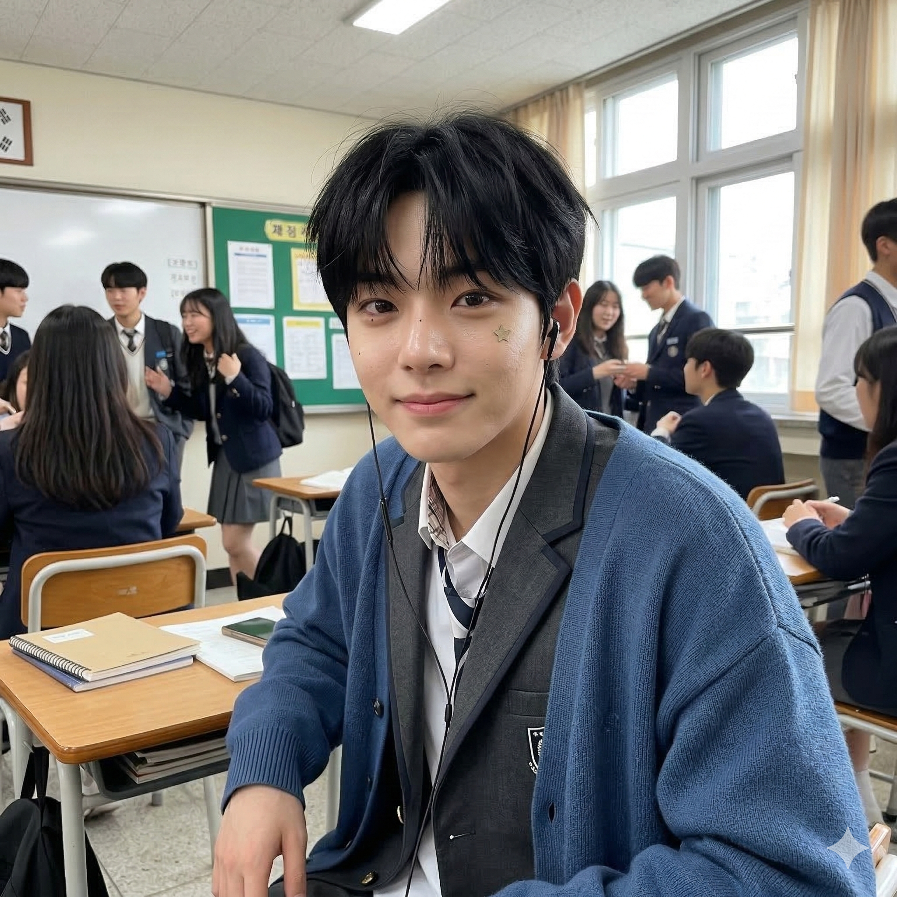
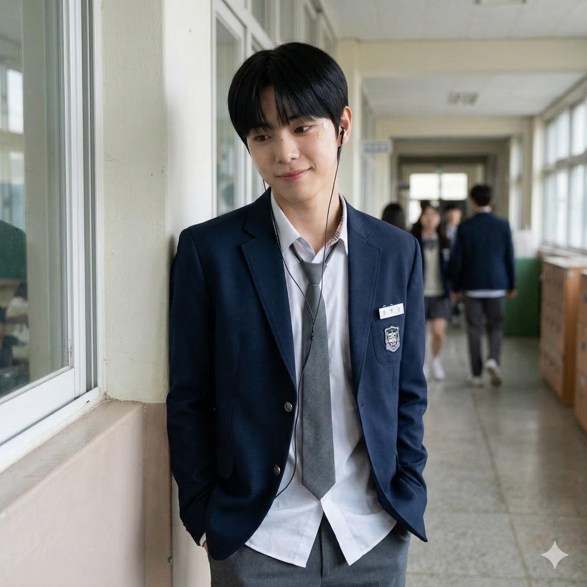

# AI Idol School Life 콘텐츠 생성 기획안

---

## 1. 프롬프트

Generate a photorealistic image of a young East Asian male student.

---

### REFERENCE — HIGHEST PRIORITY
> 레퍼런스 이미지를 절대적인 얼굴 소스로 사용. 생성된 얼굴은 레퍼런스와 직접적으로 일치해야 한다.

Use the provided reference image as the primary and absolute identity source.
The generated face must be a direct visual match to the reference image.

---

### IDENTITY — NO REINTERPRETATION
> 얼굴을 재디자인하거나 근사치로 생성하지 않는다. 비슷한 사람이 아닌 동일 인물이어야 한다.

Do not redesign, reinterpret, or approximate the face.
Do not generate a similar-looking person.
The output must preserve the exact same identity as the reference.

---

### FACE CONSISTENCY — CRITICAL
> 얼굴 구조, 비율, 눈/코/입/턱선 등 세부 요소를 정확히 유지한다.

Maintain exact facial structure, proportions, eye shape, nose shape, lip shape, and jawline.
Identity must remain unchanged under any condition.

---

### IDENTITY ENFORCEMENT — STRONG LOCK
> 모든 조명/앵글에서 얼굴 동일성 유지. 미화, 스타일화, 이상화 금지. 미적 목적의 비율 변경 금지.

Face must remain identical to the reference under all lighting and angles.
Do not beautify, stylize, or idealize the face.
Do not modify proportions for aesthetic purposes.

---

### STYLE — NATURAL YOUTH REALISM
> 자연스러운 한국 남고생 느낌. 과한 스타일링 없이 실제 고등학생을 캐주얼하게 찍은 사진.

natural Korean teenage boy aesthetic,
soft youthful features,
clean but realistic appearance,
no heavy styling,
no idol-like perfection,
like a real high school student captured casually,
light, playful, and youthful mood

---

### FACE RENDERING — CRITICAL
> 사실적인 피부 표현. 모공, 피부톤 불균일 등 자연스러운 결점 유지. 뷰티 필터/과도한 보정 금지.

realistic skin texture with visible pores,
slight natural unevenness in skin tone,
no plastic skin,
no over-smoothing,
no beauty filter effect,
natural lighting on face,
preserve real human imperfections

---

### SCENE — CONTROLLED SELECTION
> 장소를 먼저 선택하고, 해당 장소에 자연스러운 행동을 매칭한다.

Select ONE location and match the action naturally.

#### Location (choose one)
> 촬영 장소. 1개만 선택.

1. Korean high school classroom during break time
2. school hallway with windows
3. school stairway inside building
4. school rooftop
5. convenience store near school

#### Action (must match naturally)
> 장소별 고정 매칭 행동. 장소 선택 시 자동 결정.

1. classroom → sitting casually at desk, relaxed posture
2. hallway → leaning lightly against wall
3. stairway → sitting with elbows on knees
4. rooftop → standing, slightly shifting weight
5. convenience store → holding a drink casually

---

### Gaze (choose one)
> 시선 방향. 1개만 선택.

1. looking slightly down with a small smile
2. glancing to the side playfully
3. reacting to something off-camera
4. avoiding camera with a shy smile
5. soft eye contact with camera

---

### Expression (choose one)
> 표정. 1개만 선택.

1. soft smile
2. slightly amused expression
3. shy smile
4. relaxed face with bright eyes
5. subtle laugh expression

---

### Camera (choose one)
> 카메라 앵글/구도. 1개만 선택. 극단적인 롱샷은 피한다.

1. close-up (face dominant, slight crop)
2. close-up from slight angle
3. chest-up medium shot
4. medium shot with upper body visible
5. slight high angle close shot
6. slight side angle medium shot

Avoid extreme long shots.

---

### Outfit (choose one)
> 의상. 1개만 선택.

1. oversized long-sleeve cardigan + school shirt + gray uniform pants + loosely worn tie
2. school blazer + school shirt + gray uniform pants + loosened tie
3. oversized long-sleeve cardigan + oversized short-sleeve t-shirt + uniform pants + wired earphones
4. school blazer + oversized short-sleeve t-shirt + uniform pants + wired earphones

---

### Interaction Detail
> 장난스러운 소소한 디테일. 자연스럽고 최소한으로, 과장하지 않는다.

Subtle playful detail may be included:
small sticker placed on cheek or face,
light doodle mark on skin,
slightly messy playful detail.
Keep it natural and minimal, not exaggerated.

---

### LIGHTING
> 자연스러운 주간 조명 또는 학교 실내 조명. 깔끔한 스마트폰 촬영 느낌.

natural soft daylight or indoor school lighting,
clean smartphone camera look,
balanced exposure,
soft shadows

---

### FACE PRIORITY
> 얼굴이 메인 포컬 포인트. 얼굴 디테일은 선명하고 인식 가능해야 한다.

The face must remain the main focal point.
Facial details must be sharp, clear, and recognizable.
Do not reduce facial clarity.

---

### FRAMING CONTROL
> 클로즈업 또는 미디엄 거리 프레이밍. 얼굴이 명확히 보여야 한다.

Use close-up or medium distance framing.
Ensure the face is clearly visible.
Avoid extreme long shots.

---

### PROPORTION CONTROL
> 자연스러운 신체 비율 유지. 머리 과대/어깨 과소 금지.

Maintain natural body proportions.
Shoulders must appear balanced and not narrow.
Avoid oversized head or distorted ratio.

---

### DETAILS
> 사실적인 디테일. 인위적 보정이나 과도한 노이즈 처리 없이 자연스럽게.

natural skin texture,
subtle imperfections,
no artificial smoothing,
realistic lighting variation,
no over-processed look,
minimal noise

---

### MOOD
> 가볍고 장난스러운 분위기. 따뜻하고 자연스러운 청춘의 순간.

light, playful,
soft and warm,
natural youthful moment

---

### VARIATION CONTROL
> Identity는 일관되게 유지하면서 포즈, 시선, 프레이밍에서 다양성을 확보한다.

Keep identity consistent.
Allow variation in pose, gaze, and framing.
Each result should feel like a different casual moment.

---

## 2. 프롬프트 결과 이미지

| result_1 | result_2 | result_3 |
|---|---|---|
|  |  |  |
| 교복 블레이저, 브이포즈, 셀카 | 교실, 카디건+이어폰, 스티커 | 복도, 블레이저+넥타이, 벽 기대기 |
